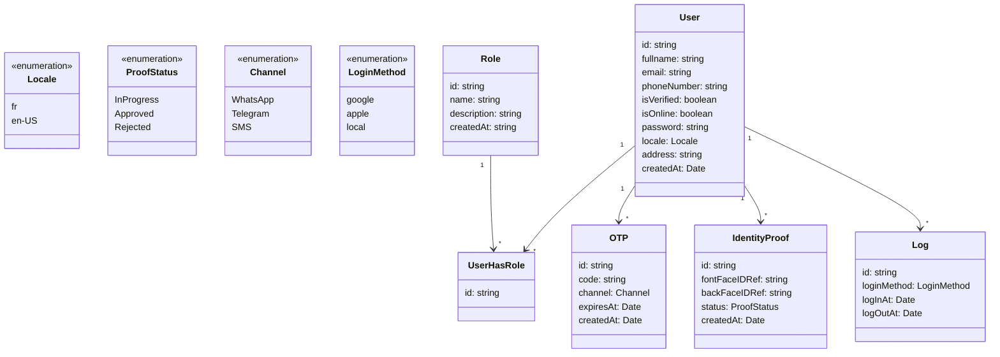

```mermaid
 classDiagram
      class Locale {
        <<enumeration>>
        fr
        en-US
      }
      class ProofStatus {
        <<enumeration>>
        InProgress
        Approved
        Rejected
      }
      class Channel {
        <<enumeration>>
        WhatsApp
        Telegram
        SMS
      }
      class LoginMethod {
        <<enumeration>>
        google
        apple
        local
      }
      class Role {
          id: string
          name: string
          description: string
          createdAt: string
       }
      class OTP {
          id: string  
          code: string
          channel: Channel
          expiresAt: Date
          createdAt: Date
      }
      class Log {
          id: string
          loginMethod: LoginMethod
          logInAt: Date
          logOutAt: Date
      }
      class IdentityProof {
          id: string
          fontFaceIDRef: string
          backFaceIDRef: string
          status: ProofStatus
          createdAt: Date
      }
      class User {
          id: string
          fullname: string
          email: string
          phoneNumber: string
          isVerified: boolean
          isOnline: boolean
          password: string
          locale: Locale
          address: string
          createdAt: Date
      }
      class UserHasRole {
          id: string
      }
      User "1" --> "*" UserHasRole
      Role "1" --> "*" UserHasRole
      User "1" --> "*" OTP
      User "1" --> "*" IdentityProof
      User "1" --> "*" Log
```
