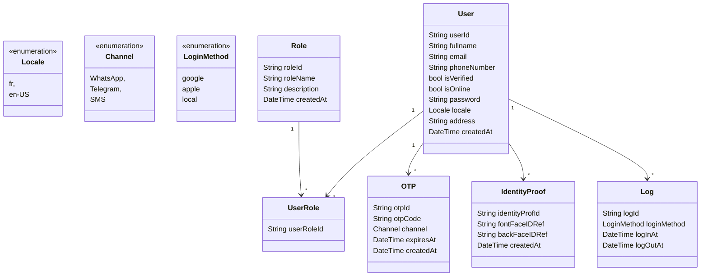

```mermaid
 classDiagram
      class Locale{
        <<enumeration>>
        fr,
        en-US
      }
      class Channel{
        <<enumeration>>
        WhatsApp,
        Telegram,
        SMS
      }
      class LoginMethod{
        <<enumeration>>
        google
        apple
        local
      }
      class Role{
          String roleId
          String roleName
          String description
          DateTime createdAt
       }
      class OTP{
          String otpId  
          String otpCode
          Channel channel
          DateTime expiresAt
          DateTime createdAt
      }
      class Log{
          String logId
          LoginMethod loginMethod
          DateTime logInAt
          DateTime logOutAt
      }
      class IdentityProof{
          String identityProfId
          String fontFaceIDRef
          String backFaceIDRef
          DateTime createdAt
      }
      class User{
          String userId
          String fullname
          String email
          String phoneNumber
          bool isVerified
          bool isOnline
          String password
          Locale locale
          String address
          DateTime createdAt
      }
      class UserRole{
          String userRoleId
      }
      User "1" --> "*" UserRole
      Role "1" --> "*" UserRole
      User "1" --> "*" OTP
      User "1" --> "*" IdentityProof
      User "1" --> "*" Log
```
