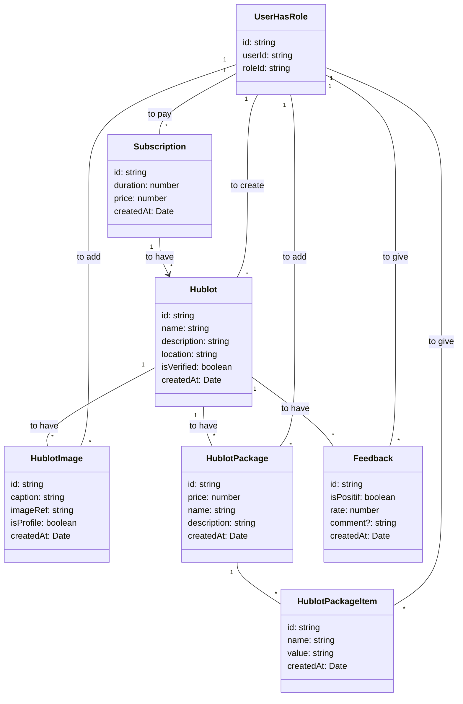

```mermaid
  classDiagram
    class Hublot {
      id: string
      name: string
      description: string
      location: string
      isVerified: boolean
      createdAt: Date
    }
    class HublotImage {
      id: string
      caption: string
      imageRef: string
      isProfile: boolean
      createdAt: Date
    }
    class HublotPackage {
      id: string
      price: number
      name: string
      description: string
      createdAt: Date
    }
    class HublotPackageItem {
      id: string
      name: string
      value: string
      createdAt: Date
    }
    class Feedback {
      id: string
      isPositif: boolean
      rate: number
      comment?: string
      createdAt: Date
    }
    class Subscription {
      id: string
      duration: number 
      price: number
      createdAt: Date
    }
    Hublot "1" -- "*" HublotPackage: to have
    Hublot "1" -- "*" HublotImage: to have
    Hublot "1" -- "*" Feedback: to have

    Subscription "1" --> "*" Hublot: to have
    HublotPackage "1" -- "*" HublotPackageItem

    class UserHasRole {
        id: string
        userId: string
        roleId: string
    }
    UserHasRole "1" -- "*" Hublot: to create
    UserHasRole "1" -- "*" HublotPackage: to add
    UserHasRole "1" -- "*" HublotPackageItem: to give
    UserHasRole "1" -- "*" HublotImage: to add
    UserHasRole "1" -- "*" Feedback: to give
    UserHasRole "1" -- "*" Subscription: to pay
```
